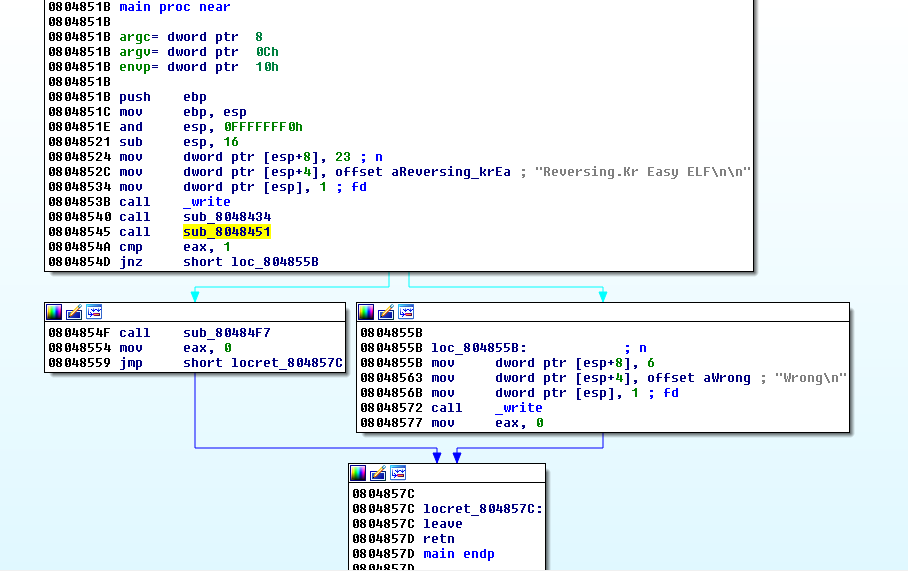
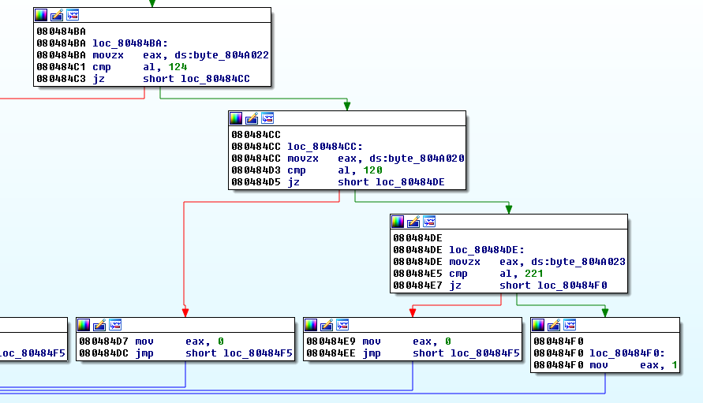

#Easy-ELF

Nothing much when you first open it up in Ida. 

It prints out Reversing.Kr Easy ELF to the screen and makes a call to two functions:
* call sub_8048434
* call sub_8048451

sub_8048434 doesnt do much other than getting the input and stores in eax.

sub_8048451 is the function that we want to pay attnetion to.

Notice it does some calculation on each character and compare against specific value. 

Known:
* Answers are 5 characters and first byte is at 804A020
* comparing lower 8 bit (al) to specific value

From this point, all you need to do is 
movzx   eax, ds:byte_804A021
cmp     al, 31h
Second char : 0x31 = '1'

movzx   eax, ds:byte_804A020
xor     eax, 52
First char : chr(52 ^ 124) = 'L'

movzx   eax, ds:byte_804A022
xor     eax, 50 
Third char : chr(50 ^ 124) = 'N'

movzx   eax, ds:byte_804A023
xor     eax, 0FFFFFF88h
Fourth char : chr(136 ^ 221) = 'U'

movzx   eax, ds:byte_804A024
cmp     al, 88
Fifth char : 88 = 'X'

'L1NUX'

Test

